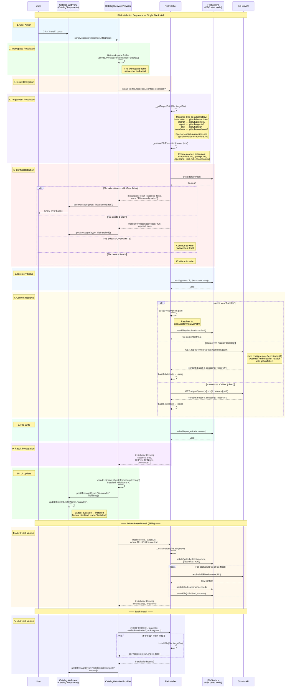

```mermaid
sequenceDiagram
    participant U as User
    participant W as Catalog Webview<br/>(CatalogTemplate.ts)
    participant P as CatalogWebviewProvider
    participant FI as FileInstaller
    participant FS as FileSystem<br/>(VSCode / Node)
    participant GH as GitHub API

    Note over U,GH: FileInstallation Sequence — Single File Install

    %% Step 1: User triggers install
    rect rgb(235, 248, 255)
    Note left of U: 1. User Action
    U->>W: Click "Install" button
    W->>P: sendMessage('installFile', {fileData})
    end

    %% Step 2: Provider resolves workspace
    rect rgb(235, 255, 235)
    Note left of U: 2. Workspace Resolution
    P->>P: Get workspace folder:<br/>vscode.workspace.workspaceFolders[0]
    Note right of P: If no workspace open,<br/>show error and abort
    end

    %% Step 3: Delegate to FileInstaller
    rect rgb(255, 245, 235)
    Note left of U: 3. Install Delegation
    P->>FI: installFile(file, targetDir, conflictResolution?)
    end

    %% Step 4: Resolve target path
    rect rgb(245, 240, 255)
    Note left of U: 4. Target Path Resolution
    FI->>FI: _getTargetPath(file, targetDir)
    Note right of FI: Maps file type to subdirectory:<br/>instruction → .github/instructions/<br/>prompt → .github/prompts/<br/>agent → .github/agents/<br/>skill → .github/skills/<br/>cookbook → .github/cookbooks/<br/><br/>Special: copilot-instructions.md<br/>→ .github/copilot-instructions.md
    FI->>FI: _ensureFileExtension(name, type)
    Note right of FI: Ensures correct extension:<br/>.instructions.md, .prompt.md,<br/>.agent.md, .skill.md, .cookbook.md
    end

    %% Step 5: Check existing file
    rect rgb(255, 240, 240)
    Note left of U: 5. Conflict Detection
    FI->>FS: exists(targetPath)
    FS-->>FI: boolean

    alt File exists & no conflictResolution
        FI-->>P: InstallationResult {success: false,<br/>error: "File already exists"}
        P->>W: postMessage({type: 'installationError'})
        W->>U: Show error badge
    else File exists & SKIP
        FI-->>P: InstallationResult {success: true,<br/>skipped: true}
        P->>W: postMessage({type: 'fileInstalled'})
    else File exists & OVERWRITE
        Note right of FI: Continue to write<br/>(overwritten: true)
    else File does not exist
        Note right of FI: Continue to write
    end
    end

    %% Step 6: Create parent directory
    rect rgb(240, 248, 255)
    Note left of U: 6. Directory Setup
    FI->>FS: mkdir(parentDir, {recursive: true})
    FS-->>FI: void
    end

    %% Step 7: Fetch content
    rect rgb(255, 252, 235)
    Note left of U: 7. Content Retrieval
    alt source === 'Bundled'
        FI->>FI: _assetResolver(file.path)
        Note right of FI: Resolves to:<br/>dist/assets/<relativePath>
        FI->>FS: readFile(absoluteAssetPath)
        FS-->>FI: file content (string)
    else source === 'Online' (catalog)
        FI->>GH: GET /repos/{owner}/{repo}/contents/{path}
        Note right of GH: Uses config.remoteRepositories[0]<br/>Optional: Authorization header<br/>with githubToken
        GH-->>FI: {content: base64, encoding: "base64"}
        FI->>FI: base64 decode → string
    else source === 'Online' (direct)
        FI->>GH: GET /repos/{owner}/{repo}/contents/{path}
        GH-->>FI: {content: base64, encoding: "base64"}
        FI->>FI: base64 decode → string
    end
    end

    %% Step 8: Write file
    rect rgb(235, 255, 245)
    Note left of U: 8. File Write
    FI->>FS: writeFile(targetPath, content)
    FS-->>FI: void
    end

    %% Step 9: Return result
    rect rgb(248, 235, 255)
    Note left of U: 9. Result Propagation
    FI-->>P: InstallationResult {<br/>success: true,<br/>filePath, fileName,<br/>overwritten?}
    end

    %% Step 10: UI notification
    rect rgb(235, 255, 235)
    Note left of U: 10. UI Update
    P->>P: vscode.window.showInformationMessage(<br/>"Installed: <fileName>")
    P->>W: postMessage({type: 'fileInstalled',<br/>fileName})
    W->>W: updateFileStatus(fileName, 'installed')
    Note right of W: Badge: available → installed<br/>Button: disabled, text = "Installed"
    end

    Note over U,GH: ─── Folder-Based Install (Skills) ───

    rect rgb(255, 248, 235)
    Note left of U: Folder Install Variant
    P->>FI: installFile(file, targetDir)<br/>where file.isFolder === true
    FI->>FI: _installFolder(file, targetDir)
    FI->>FS: mkdir(.github/skills/<name>,<br/>{recursive: true})
    loop For each child file in file.files[]
        FI->>GH: fetch(childFile.downloadUrl)
        GH-->>FI: raw content
        FI->>FS: mkdir(child subdirs if needed)
        FI->>FS: writeFile(childPath, content)
    end
    FI-->>P: InstallationResult {<br/>filesInstalled, totalFiles}
    end

    Note over U,GH: ─── Batch Install ───

    rect rgb(240, 240, 255)
    Note left of U: Batch Install Variant
    P->>FI: installFiles(files[], targetDir,<br/>conflictResolution?, onProgress?)
    loop For each file in files[]
        FI->>FI: installFile(file, targetDir)
        FI-->>P: onProgress(result, index, total)
    end
    FI-->>P: InstallationResult[]
    P->>W: postMessage({type: 'batchInstallComplete',<br/>results})
    end
```
