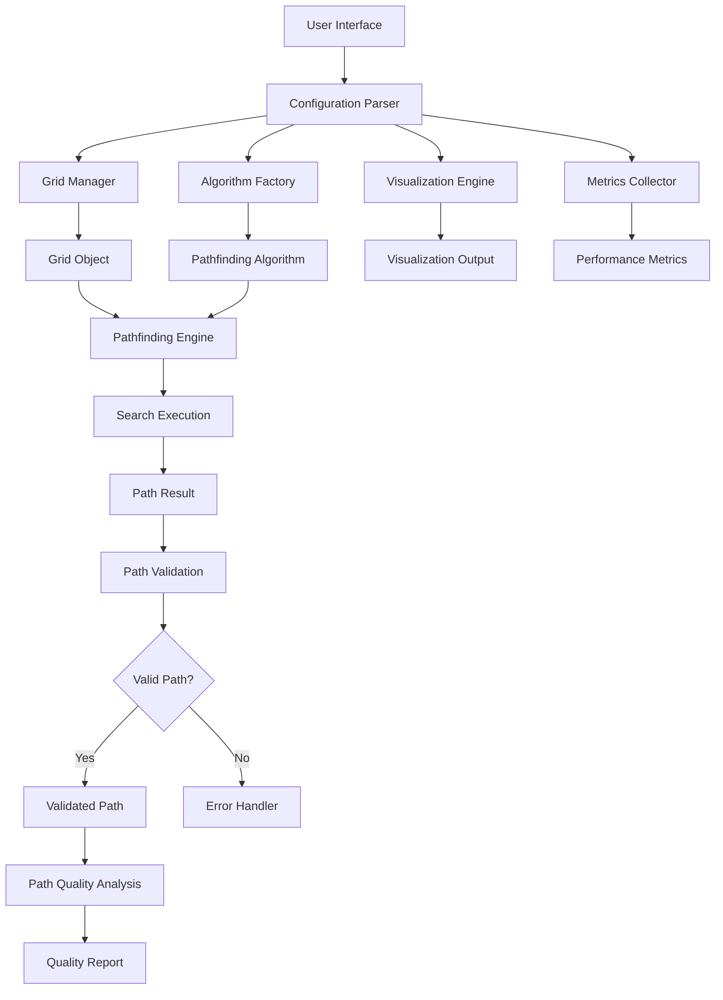

<!--
This instruction file is to be used with Abhishek's workflow, and is used to provide guidance on quick prototyping. The workflow uses a set of instruction files, prompts and chatmodes,
all pipelined together to create documents that help in Copilot implementing an idea into a working project.

Relevant workflow stage files: planning.instructions.md, design.instructions.md, implementation.instructions.md, tasking.instructions.md, testing.instructions.md, review.instructions.md
Relevant design files: uml.md, dataflows.md, sequences.md 

Relevant prompt files: planning.prompt.md, design.prompt.md, taskplan.prompt.md, testplan.prompt.md, review.prompt.md, task.prompt.md

Relevant chatmode files: Plan.chatmode.md, Deep-Planning.chatmode.md, Research.chatmode.md, Code.chatmode.md
-->

# Design Instructions

## Objective
Create detailed design documentation including architecture, components, and interactions.

## Inputs Required
- **Project Plan**: Comprehensive document from `PLANNING.md` with scope, requirements, architecture, technology stack, and timeline.

## Required Deliverables

- All artifacts are to be put into a dedicated `docs/` directory for the project.

### 1. Design Diagrams (`DESIGN.md`)
- If you are working with an existing project, **DO NOT** alter the existing design. 
- If `DESIGN.md` does not exist for an existing project, create it with your understanding of the system architecture.
- This file will contain the high-level core architecture, showing how the main components are connected.
    - If the architecture is simple enough, use ASCII diagrams.
    - If the architecture is complex, use Mermaid diagrams.
- Do not generate detailed component information in this document.

### 2. Component Diagrams (`<Component-Name>.md`)

- Inside the `docs/` directory, create a subdirectory called `components/` where these components files will live.
- For each component you generate in the core architecture in `DESIGN.md`, create a separate detailed component file.
- Name the file after the component (e.g., `GlobalCoordinator.md`)
- For each component, generate detailed Mermaid diagrams showing its internal structure and interactions.
- In this file, include for each component (in its own file):
  - Component Overview
  - Key Classes and Interfaces
  - Internal Workings (e.g., algorithms, data structures)
  - Interactions with Other Components
  - Dependencies and Relationships
  - Performance Standards
  - Error Handling Boundaries
  - Component Testing Strategy

  - ### Testing Requirements
    - Each core component must include unit tests with:
        - Basic parameter validation tests
        - 1 expected use case test
        - 1 edge case test
        - 1 failure case test
        - Error handling logic testing

- Ensure that this process is followed for **ALL** components.

### 3. Implementation Strategy (`IMPLEMENTATION.md`)
- Coding standards and code structure
- Testing strategies with framework requirements
- Deployment plans
- CI/CD pipeline setup
- Documentation Strategy
    

## Sample Templates

### Simple Architecture Diagram Format
```
┌─────────────────────────────────────────────────────────────┐
│                    Application Layer                        │
├─────────────────────────────────────────────────────────────┤
│  CLI Interface  │  Config Manager  │  Report Generator      │
├─────────────────────────────────────────────────────────────┤
│                   Visualization Layer                       │
├─────────────────────────────────────────────────────────────┤
│  Grid Renderer  │  Animation Engine │  Plot Generator       │
├─────────────────────────────────────────────────────────────┤
│                Performance Analysis Layer                   │
├─────────────────────────────────────────────────────────────┤
│ Metrics Collector│ Path Analyzer   │  Benchmark Runner      │
├─────────────────────────────────────────────────────────────┤
│                  Core Algorithm Layer                       │
├─────────────────────────────────────────────────────────────┤
│  A* Family      │  Graph Algorithms │  Heuristic Functions  │
├─────────────────────────────────────────────────────────────┤
│                   Data Management Layer                     │
├─────────────────────────────────────────────────────────────┤
│ Map Generator   │  Grid Manager    │  Result Persistence    │
└─────────────────────────────────────────────────────────────┘
```

### Complex Architecture Diagram Format
```
graph TB
    subgraph "External Systems Layer"
        SLURM[SLURM Controller]
        K8S[Kubernetes API Server]
        CLI[CLI/API Interface]
    end
    
    subgraph "Control Plane"
        GC[Global Coordinator]
        PM[Policy Manager]
        REG[Node Registry]
        FM[Fallback Manager]
    end
    
    subgraph "Data Plane"
        MB[Message Bus<br/>gRPC/NATS]
        SD[State Database<br/>etcd/Redis]
    end
    
    subgraph "Node Layer"
        NA1[Node Agent 1]
        NA2[Node Agent 2]
        NAN[Node Agent N]
    end
    
    SLURM --> GC
    K8S --> GC
    CLI --> GC
    
    GC <--> MB
    PM <--> MB
    REG <--> MB
    FM <--> MB
    
    MB <--> SD
    
    MB <--> NA1
    MB <--> NA2
    MB <--> NAN
    
    NA1 <--> NA2
    NA2 <--> NAN
    NA1 <--> NAN
```

### Component Diagram Format


**Note**: All deliverables must be completed to receive a satisfactory rating.