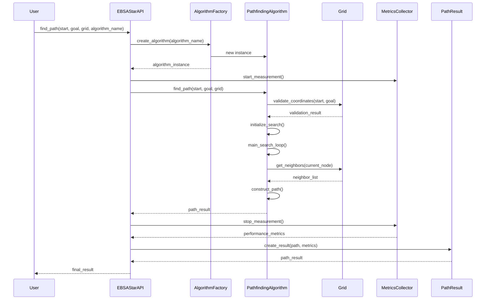

<!--
This instruction file is to be used with Abhishek's workflow, and is used to provide guidance on quick prototyping. The workflow uses a set of instruction files, prompts and chatmodes,
all pipelined together to create documents that help in Copilot implementing an idea into a working project.

Relevant workflow stage files: planning.instructions.md, design.instructions.md, implementation.instructions.md, tasking.instructions.md, testing.instructions.md, review.instructions.md
Relevant design files: uml.md, dataflows.md, sequences.md 

Relevant prompt files: planning.prompt.md, design.prompt.md, taskplan.prompt.md, testplan.prompt.md, review.prompt.md, task.prompt.md

Relevant chatmode files: Plan.chatmode.md, Deep-Planning.chatmode.md, Research.chatmode.md, Code.chatmode.md
-->

### Sequence Diagrams Instructions

## Objective
Create detailed sequence diagrams for component interactions.

## Inputs Required
- **Component Design**: Comprehensive component design document generated by the system design process.
**OR**
- **Core Architecture**: High-level architecture document outlining the main components.

## Required Deliverables

- All sequence diagrams generated are to be stored inside the `docs/sequences/` directory (if it does not exist, create it).

### Sequence Diagrams (`<Component-Name>-SD.md`)
- Based on the user's input:
    - If the user has provided a specific component or set of components in context, generate sequence diagrams for those components using the files provided.
    - If no specific components are provided, generate sequence diagrams for all major components identified in the design process using `DESIGN.md`.  
    - In addition to these, create sequence diagrams for the end-to-end interaction for the entire system so that the user can visualize the flow of control.
    
### Sequence Diagram Format
