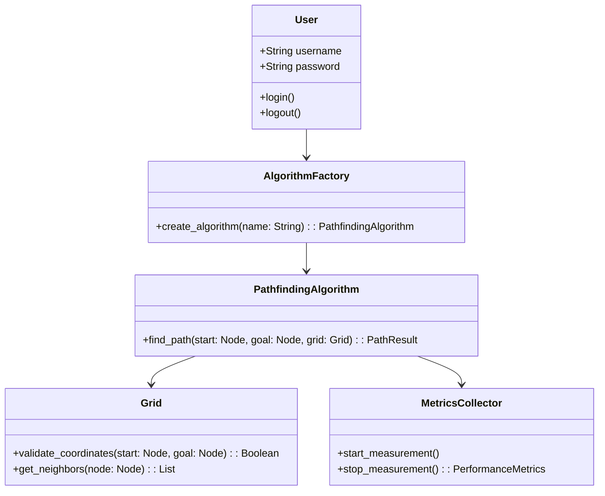

<!--
This instruction file is to be used with Abhishek's workflow, and is used to provide guidance on quick prototyping. The workflow uses a set of instruction files, prompts and chatmodes,
all pipelined together to create documents that help in Copilot implementing an idea into a working project.

Relevant workflow stage files: planning.instructions.md, design.instructions.md, implementation.instructions.md, tasking.instructions.md, testing.instructions.md, review.instructions.md
Relevant design files: uml.md, dataflows.md, sequences.md 

Relevant prompt files: planning.prompt.md, design.prompt.md, taskplan.prompt.md, testplan.prompt.md, review.prompt.md, task.prompt.md

Relevant chatmode files: Plan.chatmode.md, Deep-Planning.chatmode.md, Research.chatmode.md, Code.chatmode.md
-->

# UML Design Instructions

## Objective
Create detailed UML documentation for components generated by the design process.

## Inputs Required
- **Component Design**: Comprehensive component design document generated by the system design process.

## Required Deliverables

- All UML diagrams generated are to be stored inside the `docs/UML/` directory (if it does not exist, create it).

### UML Diagrams (`<Component-Name>-UML.md`)
- Based on the user's input:
    - If the user has provided a specific component or set of components in context, generate UML diagrams for those components using the files provided.
    - If no specific components are provided, generate UML diagrams for all major components identified in the design process using `DESIGN.md`.
    
- These are the UML diagrams that are expected:
    - **Core interfaces and their relationships** showing the data structures and contracts
    - **Component architecture** illustrating the modular design and dependency flow
    - **State management** depicting the component's behavioral states and transitions
    - **Interaction flows** demonstrating typical user interaction sequences
    - **Error handling** showing robust error management and recovery strategies
    - **Performance optimization** highlighting strategies for efficient operation
    - **Integration points** mapping external dependencies and platform integration
    - **Testing strategy** outlining comprehensive testing approaches

### UML Class Diagram Format
